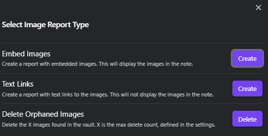
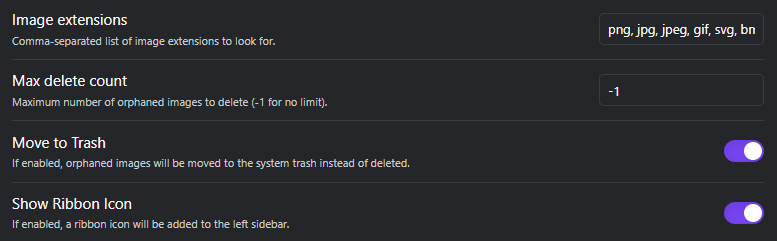

<h1 align="center">Find Orphaned Images Plugin for Obsidian</h1>

<p align="center">Utility add-on for <a href="https://obsidian.md/">Obsidian</a> knowledge base.</p>
<p align="center">*Keep your Obsidian vaults tidy with the Find Orphaned Images plugin!*</p>

---


[](https://github.com/josmarcristello/Obsidian-Find-Orphaned-Images/actions/workflows/release.yml)


**Find Orphaned Images** is an Obsidian plugin designed to help you keep your vault clean and organized by identifying and managing images that are not linked anywhere in your notes. With this plugin, you can:

1) Generate a note with a report of all the orphaned (not linked) images in your vault.
2) Delete all the orphaned images in your vault.

## Features

- **Identify Orphaned Images**: Scan your vault to find images that are not linked in any note.
- **Interactive Review Panel**: Open a sidebar panel that lists every orphaned image with a thumbnail, path, and file size. Tick the ones you want, then delete just those — with a running total of how much space you'll reclaim.
- **Broad reference detection**: Detects images used in note links and embeds, YAML frontmatter links, Canvas files (file nodes, group backgrounds, and embeds inside text cards), raw `` HTML tags, and embeds inside legacy Admonitions code blocks (` ```ad-note `).
- **Generate Reports**: Create a report listing all orphaned images (grouped by folder, with per-file and total sizes), with options to display images directly or link to them.
- **Delete Orphaned Images**: Remove orphaned images, with a confirmation preview and an optional safety scan before anything is deleted.
- **Folder Scoping**: Include or exclude specific folders, so temporary folders can be cleaned while folders of intentionally-unlinked files are left untouched.
- **Customizable Settings**: Define which image extensions to look for, where reports are saved, and a maximum number of images to delete.
- **Sidebar Button**: Access the plugin's features using the sidebar button or with the slash command.

## Installation

### Recommended
1. In Obsidian, go to Settings, Community Plugins, Browse, and search for "Find Orphaned Images". Install it. Done!

### Direct Installation (not recommended)

1. **Download the Plugin**: You can download the latest release from the [GitHub Releases](https://github.com/josmarcristello/Obsidian-Find-Orphaned-Images/releases) page.

2. **Extract the Files**: Extract the downloaded zip file and copy the files into your Obsidian vault's plugins directory: `.obsidian/plugins/find-orphaned-images/`.

3. **Enable the Plugin**: In Obsidian, go to Settings -> Community plugins, disable safe mode if it's enabled, and then search for "Find Orphaned Images". Enable it to start using the plugin.

4. **Configure Settings**: Go to Settings -> Find or Delete Orphaned Images to configure your preferences.

## Usage

### 1. Using the Sidebar Button

- **Enable Sidebar Button**: Ensure the sidebar button is enabled in the plugin settings.
- **Click the Button**: Click the button in the sidebar to open the interactive review panel, where you can browse orphaned images and delete a selected subset.

### 2. Running Commands

You can also access the plugin's features via commands (Command Palette: `Ctrl+P` / `Cmd+P`):

- **Open orphaned images panel**: Opens the interactive review panel — thumbnails, per-image checkboxes, and delete-selected.
- **Find or delete orphaned images**: Opens the options modal to generate a report or bulk-delete every orphaned image at once.

### 3. Settings

- **Image Extensions**: Specify which image file extensions to search for. Default: `png, jpg, jpeg, gif, svg, bmp`.
- **Include Folders**: One folder path per line. If set, only images inside these folders are scanned; leave empty to scan the whole vault.
- **Exclude Folders**: One folder path per line. Images inside these folders are never reported or deleted — useful for folders where unlinked files are intentional. Takes precedence over Include Folders.
- **Report Folder**: Where the generated "Orphaned Images Report" note is saved. The folder is created if it doesn't exist. Leave empty to save it in the vault root.
- **Max Delete Count**: Set a limit on how many images can be deleted in one operation. Use `-1` for no limit, or `0` to disable deletion.
- **Move to Trash**: When deleting, move images to trash (following your Obsidian "Deleted files" preference) instead of permanently deleting them. Enabled by default.
- **Safety Scan Before Deleting**: Before deleting, skip any image whose filename still appears in a note or canvas. Guards against references the plugin cannot parse. Enabled by default.
- **Show Ribbon Icon**: Toggle the sidebar (ribbon) button on or off for quick access to the plugin's features.

## Known limitations

Orphan detection relies on how Obsidian indexes references. An image may be reported as orphaned even when it is technically in use if it is referenced only by:

- **Bare (unbracketed) frontmatter values** such as `banner: my-image.png` — Obsidian does not treat these as links; only the consuming plugin (Banners, etc.) understands them. Use a bracketed wikilink (`banner: "[[my-image.png]]"`) to make it detectable.
- **Other plugins' internal formats** that store image references in their own encoding (some Excalidraw usage, custom code blocks, etc.).
- **External/remote URLs**, which are intentionally ignored (they are not vault files).

The **Safety Scan Before Deleting** setting is a conservative backstop for these cases: it will keep any image whose filename still appears anywhere in a note or canvas. When in doubt, generate a report first and review it before deleting.

## Screenshots
### Modal Options


### Configuration Options


## Contributing

Contributions are welcome! If you have suggestions for new features or find a bug, please open an issue or submit a pull request.

1. **Fork the Repository**: Click the "Fork" button at the top right of this page to fork this repository.

2. **Clone Your Fork**: Use the command `git clone https://github.com/your-username/Obsidian-Find-Orphaned-Images.git` to clone your forked repository.

3. **Create a Branch**: Use `git checkout -b your-feature-branch` to create a branch for your feature or bug fix.

4. **Make Changes**: Make your changes and commit them with a descriptive message.

5. **Push to Your Fork**: Use `git push origin your-feature-branch` to push your changes.

6. **Open a Pull Request**: Navigate to your fork on GitHub and click the "New pull request" button.

## License

This project is licensed under the GPL-3. See the [LICENSE](LICENSE) file for more information.

## Acknowledgements
- Thanks to the [Obsidian Community](https://forum.obsidian.md/) for their support and feedback.
- Inspired by the need to keep vaults organized and efficient.

---
